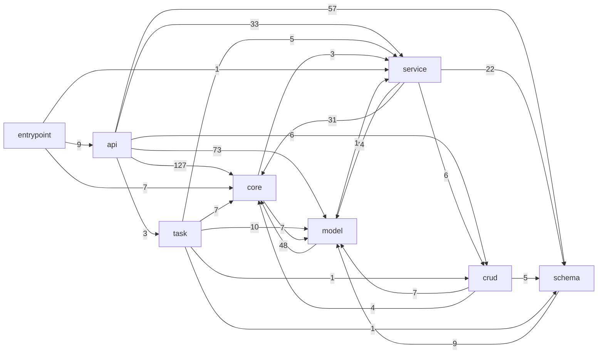

# Graphe de dépendances — backend kaapi

> Généré par `codemap/scripts/dependency_graph.py` (étape 2). Arêtes = imports internes `app.*` résolus.

- Nœuds (fichiers) : **490**
- Arêtes (imports internes) : **1186**

## Flux entre couches

Nombre d'imports d'une couche vers une autre (relations métier typiques : api→service→crud→model, schema→model).

| Couche source | → | Couche cible | # imports |
|---------------|---|--------------|----------:|
| api | → | core | 127 |
| service | → | model | 74 |
| api | → | model | 73 |
| plugin | → | core | 69 |
| api | → | schema | 57 |
| plugin | → | api | 56 |
| api | → | util | 55 |
| model | → | core | 48 |
| util | → | model | 36 |
| plugin | → | model | 33 |
| api | → | service | 33 |
| service | → | core | 31 |
| entrypoint | → | plugin | 29 |
| plugin | → | service | 24 |
| service | → | schema | 22 |
| util | → | core | 16 |
| plugin | → | util | 15 |
| plugin | → | schema | 14 |
| test | → | core | 12 |
| task | → | plugin | 10 |
| test | → | model | 10 |
| api | → | plugin | 10 |
| task | → | model | 10 |
| command | → | core | 9 |
| entrypoint | → | api | 9 |
| schema | → | model | 9 |
| service | → | util | 8 |
| test | → | service | 8 |
| service | → | plugin | 8 |
| core | → | model | 7 |
| crud | → | model | 7 |
| entrypoint | → | core | 7 |
| task | → | core | 7 |
| api | → | crud | 6 |
| service | → | crud | 6 |
| crud | → | schema | 5 |
| core | → | plugin | 5 |
| plugin | → | task | 5 |
| task | → | service | 5 |
| util | → | plugin | 5 |
| crud | → | core | 4 |
| plugin | → | crud | 4 |
| test | → | entrypoint | 4 |
| test | → | util | 4 |
| util | → | service | 4 |
| core | → | util | 3 |
| util | → | schema | 3 |
| core | → | service | 3 |
| api | → | task | 3 |
| command | → | model | 2 |
| test | → | plugin | 2 |
| test | → | schema | 2 |
| command | → | plugin | 1 |
| entrypoint | → | service | 1 |
| entrypoint | → | test | 1 |
| entrypoint | → | util | 1 |
| crud | → | util | 1 |
| task | → | util | 1 |
| model | → | service | 1 |
| plugin | → | test | 1 |
| test | → | crud | 1 |
| task | → | crud | 1 |
| task | → | schema | 1 |

## Diagramme (couches principales)

## Fichiers les plus importés (fan-in top 25)

| Fichier | Couche | Importé par |
|---------|--------|------------:|
| `app/core/db.py` | core | 170 |
| `app/core/security.py` | core | 79 |
| `app/core/config.py` | core | 44 |
| `app/plugins/advanced_auth/models/__init__.py` | model | 34 |
| `app/plugins/payment/models/payment.py` | model | 22 |
| `app/plugins/payment/providers/provider_factory.py` | service | 16 |
| `app/plugins/payment/models/provider.py` | model | 15 |
| `app/plugins/ai_integration/models.py` | model | 13 |
| `app/plugins/api_versioning/models.py` | model | 12 |
| `app/plugins/data_exchange/models.py` | model | 12 |
| `app/plugins/push_notifications/handlers/security_handler.py` | core | 12 |
| `app/schemas/veille.py` | schema | 11 |
| `app/plugins/payment/models/subscription.py` | model | 11 |
| `app/plugins/payment/providers/base_provider.py` | service | 11 |
| `app/plugins/workflow/models.py` | model | 10 |
| `app/plugins/recommendation/models/recommendation.py` | model | 9 |
| `app/models/veille.py` | model | 8 |
| `app/plugins/kyc/utils/security.py` | util | 8 |
| `app/plugins/push_notifications/models/database.py` | model | 8 |
| `app/plugins/recommendation/main.py` | plugin | 8 |
| `app/plugins/social_subscriptions/schemas/subscription.py` | schema | 8 |
| `app/plugins/advanced_auth/models/user.py` | model | 7 |
| `app/plugins/advanced_audit/models.py` | model | 7 |
| `app/plugins/messaging_service/main.py` | plugin | 7 |
| `app/core/rate_limit.py` | core | 7 |

## Fichiers aux dépendances les plus nombreuses (fan-out top 25)

| Fichier | Couche | Dépend de |
|---------|--------|----------:|
| `app/main.py` | entrypoint | 48 |
| `app/models/__init__.py` | model | 25 |
| `app/plugins/messaging_service/main.py` | plugin | 14 |
| `app/plugins/payment/main.py` | plugin | 14 |
| `app/plugins/recommendation/main.py` | plugin | 14 |
| `app/plugins/kyc/routes/simplified.py` | api | 12 |
| `app/plugins/push_notifications/main.py` | plugin | 12 |
| `app/plugins/push_notifications/services/notification_service.py` | service | 12 |
| `app/plugins/payment/providers/provider_factory.py` | service | 11 |
| `app/plugins/security/main.py` | plugin | 11 |
| `app/plugins/social_subscriptions/main.py` | plugin | 11 |
| `app/services/tekawake.py` | service | 11 |
| `app/plugins/push_notifications/routes.py` | api | 10 |
| `app/plugins/file_storage/main.py` | plugin | 9 |
| `app/plugins/file_storage/tests/test_file_storage.py` | test | 9 |
| `app/plugins/workflow/main.py` | plugin | 9 |
| `app/plugins/ai_integration/main.py` | plugin | 8 |
| `app/plugins/api_gateway/router.py` | plugin | 8 |
| `app/plugins/api_versioning/main.py` | plugin | 8 |
| `app/plugins/data_exchange/main.py` | plugin | 8 |
| `app/plugins/kyc/routes/dashboard.py` | api | 8 |
| `app/plugins/kyc/routes/profile.py` | api | 8 |
| `app/plugins/kyc/routes/region.py` | api | 8 |
| `app/plugins/kyc/routes/verification.py` | api | 8 |
| `app/plugins/kyc/utils/kyc_manager.py` | util | 8 |
