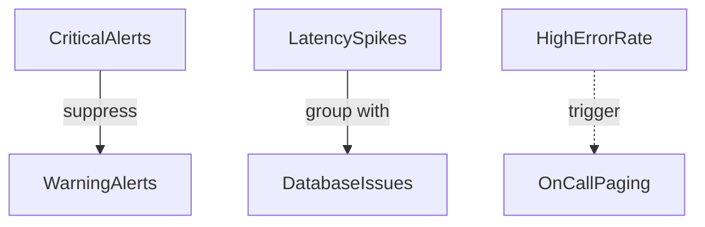

# README.md
## Production Monitoring

## Validation Checklist

✅ **Basic Health Checks**:
```bash
# Verify metrics endpoint
curl -s http://localhost:8000/metrics | jq .

# Check Prometheus targets
curl -s http://localhost:9090/api/v1/targets | jq '.data.activeTargets[].health'

# Test Alertmanager connectivity
curl -s http://localhost:9093/-/healthy
```
✅ **Configuration Validation**:

```bash
# Validate Prometheus config
docker exec prometheus promtool check config /etc/prometheus/prometheus.yml

# Check alert rules syntax
docker exec prometheus promtool check rules /etc/prometheus/alerts.yml

# Verify Alertmanager config
docker exec alertmanager amtool check-config /etc/alertmanager/alertmanager.yml
```

✅ **Grafana Setup Verification**:

```bash
# Check datasource health
curl -u admin:admin http://localhost:3000/api/datasources/1/health
```

## Troubleshooting Common Issues

❗ **Docker Compose Errors**:
- Ensure port 9090/9093/3000 are available
- Verify file permissions on mounted volumes

❗ **Missing Metrics**:
- Confirm application exposes /metrics endpoint
- Check Prometheus service discovery config

❗ **Alert Notifications**:
- Validate SLACK_WEBHOOK_URL environment variable
- Test Alertmanager configuration with:
  ```bash
  docker exec alertmanager amtool config test /etc/alertmanager/alertmanager.yml
  ```
  
**2. Final Configuration Checks**:
```bash
docker compose -f docker-compose.observability.yml config --services
# Should output: prometheus alertmanager grafana
```

**3. Alert Rule Verification**:

```bash
docker exec prometheus promtool check rules /etc/prometheus/alerts.yml
```

**4. Endpoint Smoke Test**:

```bash
curl -s http://localhost:9090/-/ready && \
curl -s http://localhost:9093/-/ready && \
curl -s http://localhost:3000/api/health
```

```bash
docker compose -f docker-compose.observability.yml down && \
docker compose -f docker-compose.observability.yml up -d
```

**5. Access Grafana at http://localhost:3000**

| HighRequestLatency | avg >1s     | 2m       | warning  |
| P95LatencySpike    | p95 >2s     | 1m       | critical |
| DatabaseDown       | db down     | 2m       | critical |
| HighErrorRate      | avg >5%     | 5m       | critical |

**6. Monitor and Resolve Issues**
- Check Prometheus and Alertmanager logs
- Look for unexpected high request latencies or errors
- Review recording rules and alert rules
- Adjust thresholds as needed
- Re-test configuration

**7. Clean Up**
```bash
docker compose -f docker-compose.observability.yml down
```

**8. Next Steps**
- Consider adding additional alert rules for specific routes or services
- Monitor and resolve any issues that occur
- Re-test configuration
- Clean up if no longer needed

## Alert Relationships


Key Rules:

Critical alerts suppress warnings/info for same routes
Related alerts group into single notifications
Infrastructure issues take priority over app-layer alerts

3. **Validation Commands**:
```bash
# Check Alertmanager config
docker compose -f docker-compose.observability.yml exec alertmanager \
  amtool check-config /etc/alertmanager/alertmanager.yml

# Test inhibition
curl -XPOST http://localhost:9093/api/v1/alerts -d'[
  {"labels": {"alertname": "HighErrorRate", "severity": "critical", "route": "/api"}},
  {"labels": {"alertname": "HighRequestLatency", "severity": "warning", "route": "/api"}}
]'
```

Final Steps:
```bash
# Reload configurations
docker compose -f docker-compose.observability.yml kill -s SIGHUP alertmanager
docker compose -f docker-compose.observability.yml kill -s SIGHUP prometheus

# Verify in Grafana
open http://localhost:3000/alerting/list
```


**9. Additional Resources**
- [Prometheus Documentation](https://prometheus.io/docs/introduction/overview/)
- [Alertmanager Documentation](https://prometheus.io/docs/alerting/overview/)
- [Grafana Documentation](https://grafana.com/docs/grafana/latest/)
